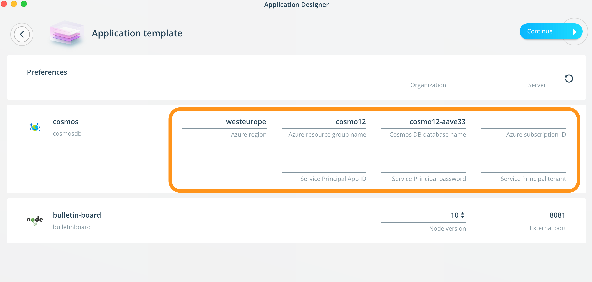
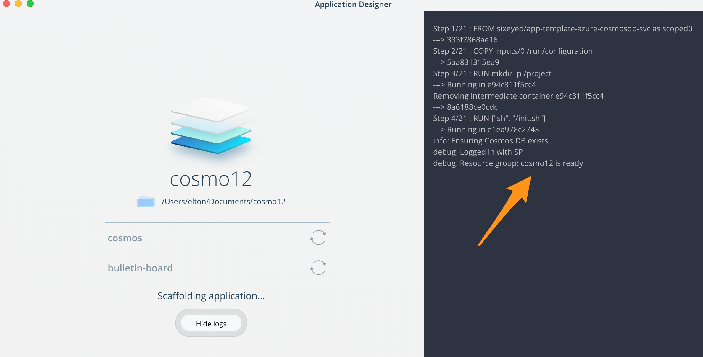
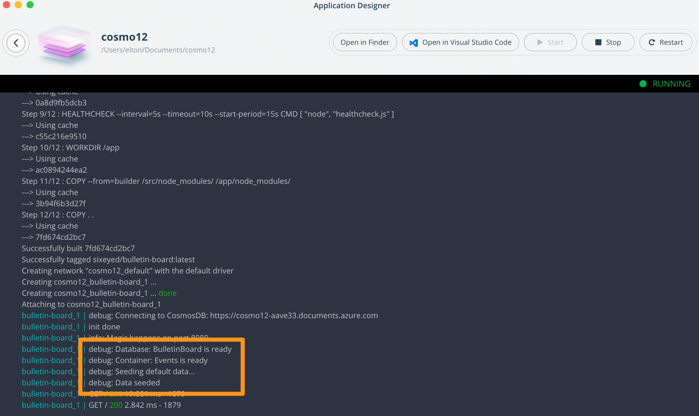

# Docker Application Template for Azure

A Docker Application Template sample, spinning up a Cosmos DB database in Azure, and connecting a local Node JS app container.

## Pre-requisites

1. A version of Docker Desktop Enterprise with Application Designer.

> The demo is a Linux app, so on Windows you need to use Linux container mode

2. A Service Principal in Azure. You can create one with the [Azure command line]():

```
az ad sp create-for-rbac --name AppTemplate --password MyGoodPassword
```

## Setup

Clone this repo:

```
git clone https://github.com/sixeyed/app-template-azure.git

cd app-template-azure
```

Pull the scaffolding images:

```
docker-compose pull
```

Copy `library.yaml` to somewhere useful:

```
cp library.yaml /tmp
```

Update your App Template config in `~/.docker/application-template/preferences.yaml` include the new library. 

This example includes the local demo library and the main Docker library:

```
apiVersion: v1alpha1
disableFeedback: false
kind: Preferences
repositories:
- name: azure-demo
  url: file:///tmp/library.yaml
- name: library
  url: https://docker-application-template.s3.amazonaws.com/production/v0.1.1/library.yaml
```

## Usage

- Run Application Designer (Docker menu -> _Design new application..._)

- Select _New Application..._ _Choose a template_. You should see the Cosmos DB app listed with all the standard templates:


- Select the template and add your Azure details (names for the Resource Group and CosmosDB Account, and your Service Principal secrets):



- Click _Continue_, give your app a name and click _Scaffold_:



> This creates the Azure Resource Group and Cosmos DB Account. When scaffolding completes, the DB is empty so there are no resource charges.

- Click _Run application_. That builds and runs the NodeJS app. You'll see log entries when the app connects to CosmosDB to insert seed data:



> The app is running in a local container, connecting to ComosDB in Azure. The app creates a database and inserts data, so now you're being charged.

- Click _Open in Visual Studio Code_ to see the generated code. The CosmosDB connection details are in `cosmosDbConfig.js`, which the scaffold service created.

- Browse to http://localhost:8081 and you'll see the app:


- Each event is stored as an item in CosmosDB. You can add or remove them from the app and see the data through the data explorer in the Azure Portal.

## Teardown

Delete the resource group you created.

Delete the Service Principal:

```
az ad sp delete --id http://AppTemplate
```

### Credits

The demo app is a modified version of [Vue Events Bulletin Board](https://github.com/chenkie/vue-events-bulletin).